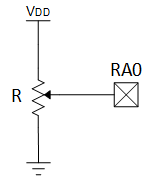
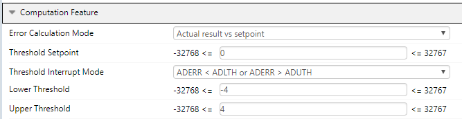
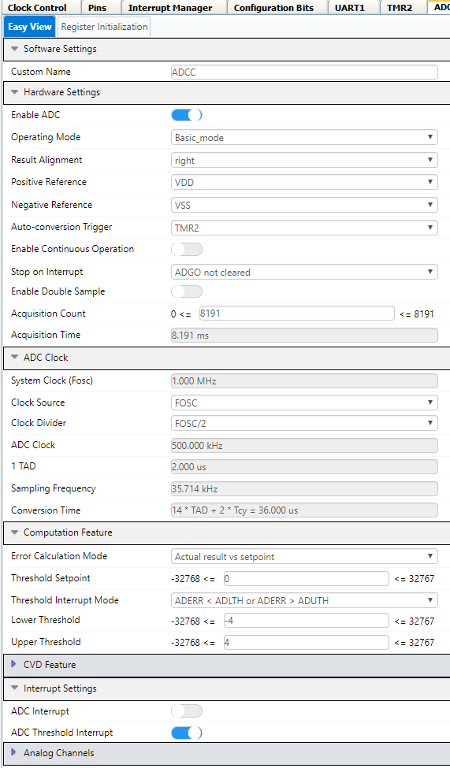
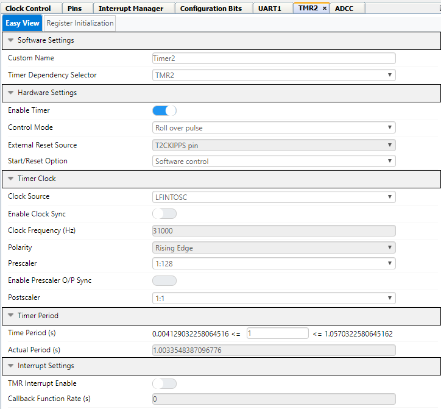
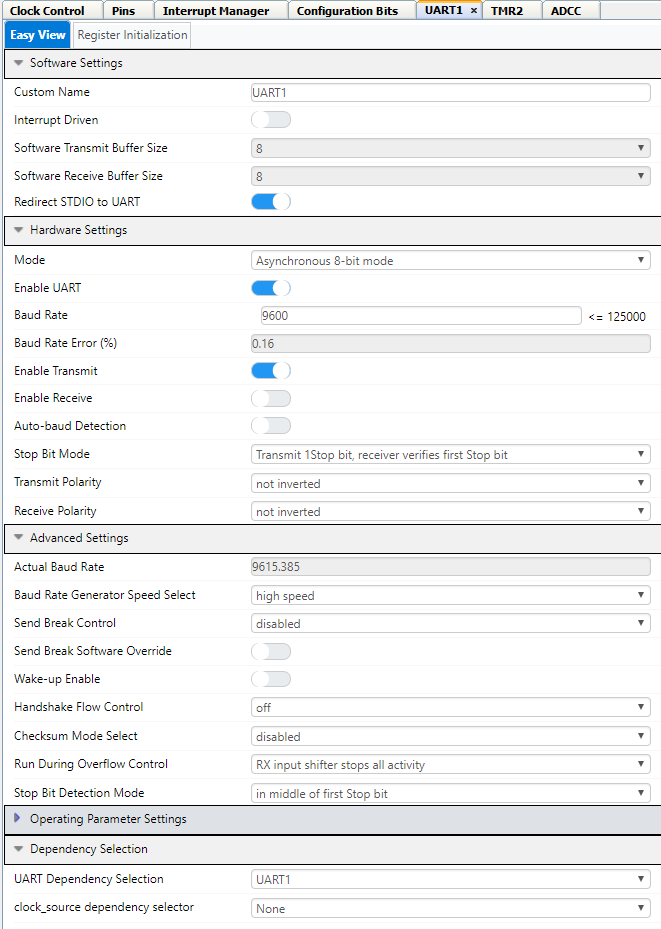

<!-- Please do not change this logo with link -->

# Adding Hysteresis to the ADCC on PIC18F57Q43

This example shows how to use the computation features of the Analog-to-Digital Converter with Computation (ADCC) to implement hysteresis in the ADCC's threshold interrupts. The PIC18F57Q43 Curiosity Nano is used in this implementation.

## Related Documentation  
* [PIC18F57Q43 Microcontroller](https://www.microchip.com/wwwproducts/en/PIC18F57Q43?utm_source=GitHub&utm_medium=TextLink&utm_campaign=MCU8_MMTCha_PIC18FQ43&utm_content=pic18f57q43-hysteresis-adcc-mplab-mcc-github)

## Software Used  
* [MPLAB® X IDE v6.20 or newer](https://www.microchip.com/en-us/development-tools-tools-and-software/mplab-x-ide?utm_source=GitHub&utm_medium=TextLink&utm_campaign=MCU8_MMTCha_PIC18FQ43&utm_content=pic18f57q43-hysteresis-adcc-mplab-mcc-github)
* [MPLAB XC8 v3.0 or newer](https://www.microchip.com/en-us/development-tools-tools-and-software/mplab-xc-compilers?utm_source=GitHub&utm_medium=TextLink&utm_campaign=MCU8_MMTCha_PIC18FQ43&utm_content=pic18f57q43-hysteresis-adcc-mplab-mcc-github)
* [MPLAB Code Configuration v4.1.0 or newer](https://www.microchip.com/mplab/mplab-code-configurator?utm_source=GitHub&utm_medium=TextLink&utm_campaign=MCU8_MMTCha_PIC18FQ43&utm_content=pic18f57q43-hysteresis-adcc-mplab-mcc-github)
  * Melody Library v1.37.23
* [Microchip PIC18F-Q Device Support v1.11.185](https://packs.download.microchip.com/)
* MPLAB Data Visualizer or other serial terminal
  * UART Settings: 9600 Baud, No Parity, 1 Stop Bit

## Hardware Used  
* [PIC18F57Q43 Curiosity Nano (DM164150)](https://www.microchip.com/developmenttools/ProductDetails/DM164150?utm_source=GitHub&utm_medium=TextLink&utm_campaign=MCU8_MMTCha_PIC18FQ43&utm_content=pic18f57q43-hysteresis-adcc-mplab-mcc-github)
* Breadboard
* Power Supply or Potentiometer (recommended 10k&#8486; )
  * Note: Demo is functional without a connected source due to random noise, but this is **not recommended.**

## Setup  
| Pin Name | Function
| -------- | --------
| RA0      | Analog Input
| RF0      | UART TX
| RF1      | UART RX (unused, but reserved)
| RF3      | LED0

Note: RF0, RF1, and RF3 are built-in to the Curiosity Nano Development Kit.

### Potentiometer Wiring  
The potentiometer is used as a voltage divider to provide a variable input source for demonstration purposes. To setup, connect one end of the potentiometer to the microcontroller's VDD and the other end to VSS. Connect the tap of the potentiometer to pin RA0. The diagram below illustrates this wiring.

## Theory of Operation  
This example operates based on the setpoint (`ADSTPT`) and the threshold (`ADLTH` and `ADUTH`) registers inside the ADCC. The setpoint sets the "center" of the hysteresis, while the threshold registers set the width of the function (in bits). By default, the width of the hysteresis is set to 8 bits, but this can be adjusted as needed.

*Configuration of the Threshold and Error*  
  

To trigger an interrupt, the difference between a result (`ADRES` or `ADFLTR`) must be greater than or less than the number of bits set by the thresholds. If this is true, the threshold test will trigger the threshold interrupt. This example uses the ISR to update the setpoint, however an alternative method using a Direct Memory Access (DMA) channel is shown in the [Voltage-to-Frequency Converter](https://github.com/microchip-pic-avr-examples/pic18f57q43-v-to-f-mplab-mcc).

## Implementation  
In this example, the ADCC has been setup in basic single conversion mode with Timer 2 (TMR2) used as the conversion trigger. Timer 2 is a 1 Hz astable timer that triggers a conversion once per second. If the threshold interrupt occurs, a flag is set to trigger a print to the UART. UART 1 prints the messages to a serial terminal such as [MPLAB Data Visualizer](https://www.microchip.com/en-us/development-tools-tools-and-software/embedded-software-center/mplab-data-visualizer?utm_source=GitHub&utm_medium=TextLink&utm_campaign=MCU8_MMTCha_PIC18FQ43&utm_content=pic18f57q43-hysteresis-adcc-mplab-mcc-github) at **9600 baud, no parity, and 1 stop bit.**

### Settings used for the ADCC  
  

### Settings used by Timer 2  
  

### Settings used by UART 1

## Tuning the Example  

### Reducing ADCC Acquisition Time  
To ensure compatibility with varying signal sources out-of-the-box, the ADCC acquisition time has been maxed out. This value can be reduced depending on the internal impedance of the voltage source, which will speeds up the conversion.

### Using an Average / Burst-Average  
This example can also be used with averaging or burst-averaging modes, but it requires a tweak to the error calculation mode set in `ADCON3`. Instead of using `ADRES - ADSTPT` for calculating the difference, the mode should be in `ADFLTR - ADSTPT`.

### Compatibility with the ADCCC  
This example should be compatible with the Analog-to-Digital Converter with Computation and Context Switching (ADCCC), however a few tweaks to the example due to added features may be required.

## Summary  
This example demonstrates a way to add hysteresis using the ADCC's threshold interrupts.
